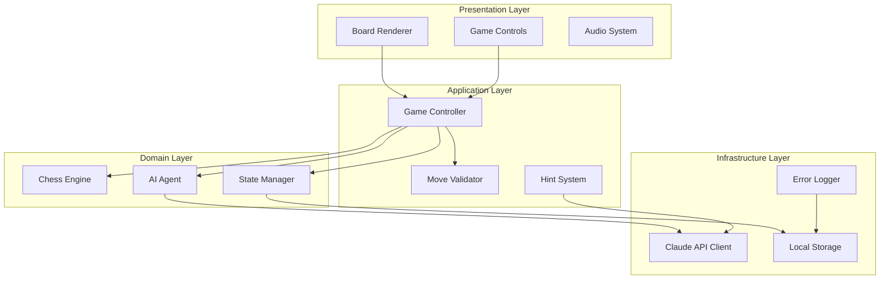
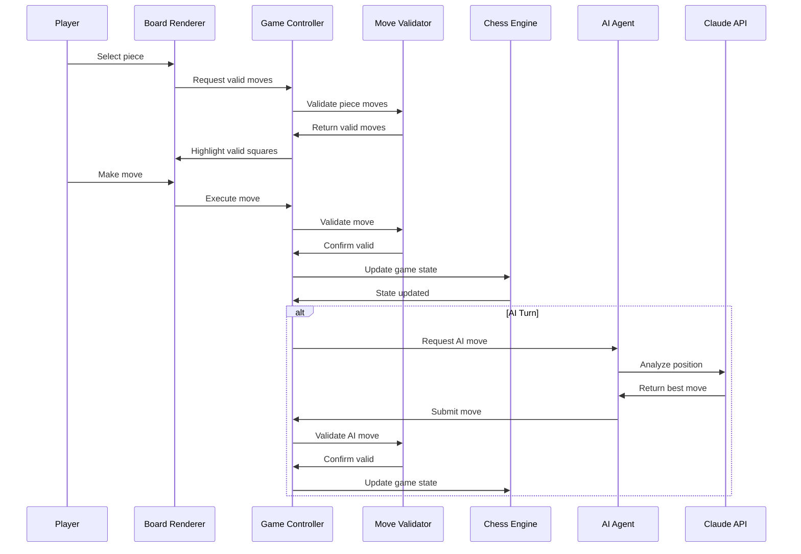

# Design Document: AI Chess Game

## Overview

The AI Chess Game is a sophisticated web-based chess application that combines traditional chess gameplay with modern AI assistance powered by Claude. The system architecture follows a modular, event-driven design with clear separation between game logic, AI processing, UI rendering, and state management.

The application leverages modern web technologies (HTML5, CSS3, JavaScript/React) to deliver a premium gaming experience featuring a futuristic dark-mode interface with neon accents. The core architecture emphasizes performance, maintainability, and extensibility while ensuring robust chess rule enforcement and intelligent AI opponent behavior.

Key architectural principles include:
- **Separation of Concerns**: Distinct layers for game logic, AI processing, and UI rendering
- **Event-Driven Architecture**: Reactive system responding to user actions and game state changes
- **Immutable State Management**: Predictable state transitions with full move history tracking
- **API-First AI Integration**: Claude API integration with fallback mechanisms and error handling
- **Responsive Design**: Mobile-first approach with progressive enhancement for desktop

## Architecture

### High-Level System Architecture



### Component Interaction Flow



## Components and Interfaces

### Game Controller

The Game Controller serves as the central orchestrator managing game flow, turn sequences, and component coordination.

**Core Responsibilities:**
- Game mode management (Player vs Player, Player vs AI)
- Turn sequence enforcement and player switching
- Move execution coordination between components
- Game state lifecycle management (start, pause, end)
- Error handling and recovery coordination

**Key Methods:**
```javascript
interface GameController {
  startNewGame(mode: GameMode, difficulty?: AIDifficulty): void
  executeMove(from: Square, to: Square, promotion?: PieceType): MoveResult
  requestHint(): Promise<HintResult>
  undoMove(): boolean
  redoMove(): boolean
  resignGame(): void
  restartGame(): void
  getCurrentGameState(): GameState
}
```

**Event Handling:**
- Player move requests from UI components
- AI move generation completion events
- Game state change notifications
- Error and exception propagation

### Chess Engine

The Chess Engine maintains the authoritative game state and enforces all chess rules and regulations.

**Core Responsibilities:**
- Board state representation using 8x8 array structure
- Piece movement and capture logic implementation
- Special rule enforcement (castling, en passant, pawn promotion)
- Check, checkmate, and stalemate detection
- Move history tracking with algebraic notation
- Game outcome determination

**Board Representation:**
```javascript
interface ChessEngine {
  board: Piece[8][8]  // 8x8 grid representation
  gameState: {
    currentPlayer: 'white' | 'black'
    castlingRights: CastlingRights
    enPassantTarget: Square | null
    halfMoveClock: number
    fullMoveNumber: number
    moveHistory: Move[]
    gameStatus: 'active' | 'check' | 'checkmate' | 'stalemate' | 'draw'
  }
  
  makeMove(move: Move): MoveResult
  isValidMove(from: Square, to: Square): boolean
  getValidMoves(square: Square): Square[]
  isInCheck(player: Player): boolean
  isCheckmate(player: Player): boolean
  isStalemate(): boolean
  exportToFEN(): string
  importFromFEN(fen: string): void
}
```

**FEN Integration:**
The engine supports Forsyth-Edwards Notation for position serialization, enabling game state persistence and debugging. Standard starting position: `rnbqkbnr/pppppppp/8/8/8/8/PPPPPPPP/RNBQKBNR w KQkq - 0 1`

### AI Agent

The AI Agent integrates with Claude API to provide intelligent move generation and game analysis.

**Core Responsibilities:**
- Claude API integration for move analysis
- Difficulty level implementation through depth control
- Move evaluation and selection logic
- Error handling for API failures
- Response time optimization and caching

**AI Difficulty Implementation:**
- **Easy (Depth 1-2)**: Basic tactical awareness, occasional blunders
- **Medium (Depth 3-4)**: Solid tactical play, strategic understanding
- **Hard (Depth 5+)**: Advanced strategic planning, minimal errors

**Claude Integration Pattern:**
```javascript
interface AIAgent {
  async generateMove(
    position: string,  // FEN notation
    difficulty: AIDifficulty,
    timeLimit: number = 5000
  ): Promise<Move>
  
  async analyzePosition(
    position: string,
    depth: number
  ): Promise<PositionAnalysis>
  
  async explainMove(
    move: Move,
    position: string
  ): Promise<string>
}
```

**Prompt Engineering Strategy:**
- Structured prompts with clear role definition
- Position context using FEN notation
- Difficulty-specific instruction sets
- JSON response format for reliable parsing
- Fallback strategies for API failures

### Move Validator

The Move Validator ensures all moves comply with chess rules before execution.

**Core Responsibilities:**
- Legal move verification for all piece types
- Special move validation (castling, en passant, pawn promotion)
- Check escape requirement enforcement
- Input sanitization and security validation
- Performance optimization for rapid validation

**Validation Pipeline:**
```javascript
interface MoveValidator {
  validateMove(
    from: Square,
    to: Square,
    board: Board,
    gameState: GameState
  ): ValidationResult
  
  getValidMoves(
    piece: Piece,
    square: Square,
    board: Board,
    gameState: GameState
  ): Square[]
  
  isSquareAttacked(
    square: Square,
    byPlayer: Player,
    board: Board
  ): boolean
}
```

### Board Renderer

The Board Renderer manages all visual aspects of the chess board and pieces.

**Core Responsibilities:**
- 8x8 chessboard visual representation
- Piece rendering with futuristic styling
- Move highlighting with neon glow effects
- Animation system for smooth piece movements
- Responsive design for multiple screen sizes
- Accessibility features and keyboard navigation

**Visual Design System:**
- **Color Palette**: Dark background (#0a0a0a), neon accents (#00ffff, #ff00ff)
- **Typography**: Futuristic sans-serif fonts with clean lines
- **Animations**: 300ms smooth transitions, easing functions
- **Effects**: Glow effects for valid moves, pulse animations for check

**Rendering Architecture:**
```javascript
interface BoardRenderer {
  renderBoard(gameState: GameState): void
  highlightValidMoves(moves: Square[]): void
  animateMove(from: Square, to: Square, duration: number): Promise<void>
  showCheckIndicator(kingSquare: Square): void
  updatePiecePositions(board: Board): void
  setTheme(theme: 'dark' | 'light'): void
  enableBoardFlip(enabled: boolean): void
}
```

### Hint System

The Hint System provides AI-powered move suggestions and strategic guidance.

**Core Responsibilities:**
- Claude API integration for move analysis
- Strategic explanation generation
- Hint limitation enforcement (3 per game)
- Visual hint presentation with board highlighting
- Educational content delivery

**Implementation Strategy:**
```javascript
interface HintSystem {
  async requestHint(
    position: string,
    playerLevel: 'beginner' | 'intermediate' | 'advanced'
  ): Promise<Hint>
  
  getRemainingHints(): number
  resetHintCount(): void
  
  interface Hint {
    suggestedMove: Move
    explanation: string
    strategicConcept: string
    confidence: number
  }
}
```

## Data Models

### Core Data Structures

**Game State Model:**
```javascript
interface GameState {
  board: Piece[][]
  currentPlayer: 'white' | 'black'
  gameMode: 'pvp' | 'pve'
  aiDifficulty?: 'easy' | 'medium' | 'hard'
  gameStatus: 'active' | 'check' | 'checkmate' | 'stalemate' | 'draw' | 'resigned'
  moveHistory: Move[]
  capturedPieces: { white: Piece[], black: Piece[] }
  castlingRights: CastlingRights
  enPassantTarget: Square | null
  halfMoveClock: number
  fullMoveNumber: number
  timeStamps: Date[]
}
```

**Piece Representation:**
```javascript
interface Piece {
  type: 'pawn' | 'rook' | 'knight' | 'bishop' | 'queen' | 'king'
  color: 'white' | 'black'
  hasMoved: boolean
  position: Square
  id: string  // Unique identifier for animations
}
```

**Move Structure:**
```javascript
interface Move {
  from: Square
  to: Square
  piece: Piece
  capturedPiece?: Piece
  promotion?: PieceType
  isCheck: boolean
  isCheckmate: boolean
  isStalemate: boolean
  algebraicNotation: string
  timestamp: Date
  moveNumber: number
}
```

**Square Coordinate System:**
```javascript
interface Square {
  file: 'a' | 'b' | 'c' | 'd' | 'e' | 'f' | 'g' | 'h'
  rank: 1 | 2 | 3 | 4 | 5 | 6 | 7 | 8
  index: number  // 0-63 for array indexing
}
```

### State Management Architecture

**Immutable State Pattern:**
- All game state changes create new state objects
- Move history maintains complete game reconstruction capability
- Undo/redo functionality through state snapshots
- Predictable state transitions with event sourcing

**Persistence Strategy:**
```javascript
interface StateManager {
  saveGameState(state: GameState): void
  loadGameState(): GameState | null
  clearSavedState(): void
  exportGamePGN(): string
  importGamePGN(pgn: string): GameState
}
```

## Error Handling

### Error Classification and Recovery

**API Integration Errors:**
- **Claude API Unavailable**: Fallback to offline mode with basic AI
- **Network Timeout**: Retry mechanism with exponential backoff
- **Invalid API Response**: Error logging and graceful degradation
- **Rate Limiting**: Queue management and user notification

**Game Logic Errors:**
- **Invalid Move Attempts**: User feedback with explanation
- **State Corruption**: Automatic state recovery from last valid position
- **Rule Violation**: Move rejection with educational feedback
- **Performance Issues**: Optimization and fallback rendering

**User Interface Errors:**
- **Browser Compatibility**: Feature detection and polyfills
- **Responsive Layout Issues**: Adaptive design with breakpoint handling
- **Animation Failures**: Graceful fallback to instant updates
- **Accessibility Problems**: Alternative interaction methods

**Error Handling Architecture:**
```javascript
interface ErrorHandler {
  handleAPIError(error: APIError): void
  handleGameLogicError(error: GameError): void
  handleUIError(error: UIError): void
  logError(error: Error, context: string): void
  showUserFriendlyMessage(message: string, type: 'info' | 'warning' | 'error'): void
}
```

## Testing Strategy

### Comprehensive Testing Approach

The testing strategy employs both unit testing and property-based testing to ensure comprehensive coverage and correctness validation.

**Unit Testing Focus:**
- Specific chess rule implementations and edge cases
- UI component behavior and user interactions
- API integration error scenarios and fallback mechanisms
- Performance benchmarks and optimization validation

**Property-Based Testing Focus:**
- Universal chess rule compliance across all possible positions
- Game state consistency and invariant preservation
- AI move generation correctness and performance bounds
- UI responsiveness and accessibility standards

**Testing Framework Configuration:**
- **Unit Tests**: Jest with React Testing Library for component testing
- **Property Tests**: fast-check library with minimum 100 iterations per property
- **Integration Tests**: Cypress for end-to-end user workflow validation
- **Performance Tests**: Lighthouse and custom benchmarking for optimization

**Test Organization:**
```javascript
// Property test example structure
describe('Feature: ai-chess-game, Property 1: Move validation consistency', () => {
  it('should validate moves consistently across all board positions', () => {
    fc.assert(fc.property(
      fc.record({
        board: boardGenerator,
        move: moveGenerator
      }),
      ({ board, move }) => {
        const result1 = moveValidator.validateMove(move, board);
        const result2 = moveValidator.validateMove(move, board);
        expect(result1).toEqual(result2);
      }
    ), { numRuns: 100 });
  });
});
```

## Correctness Properties

*A property is a characteristic or behavior that should hold true across all valid executions of a system—essentially, a formal statement about what the system should do. Properties serve as the bridge between human-readable specifications and machine-verifiable correctness guarantees.*

Based on the prework analysis of acceptance criteria, the following correctness properties ensure the AI Chess Game functions correctly across all possible game states and user interactions:

### Property 1: Move Validation Consistency
*For any* chess position and any attempted move, the Move_Validator should consistently validate the move according to chess rules, returning the same result for identical inputs and only allowing moves that comply with standard chess regulations including special rules like castling, en passant, and check escape requirements.
**Validates: Requirements 1.3, 2.1, 2.2, 2.4**

### Property 2: Game State Integrity  
*For any* sequence of valid moves, the Chess_Engine should maintain consistent game state including accurate piece positions, turn alternation, move history tracking, and proper capture handling, ensuring the board state always reflects the true game position.
**Validates: Requirements 1.4, 1.5, 2.5, 5.1**

### Property 3: Check and Mate Detection
*For any* chess position, the Chess_Engine should correctly identify check, checkmate, and stalemate conditions, enforcing check escape requirements and properly declaring game outcomes when terminal positions are reached.
**Validates: Requirements 1.6, 1.7, 1.8**

### Property 4: AI Move Legality
*For any* valid chess position and any AI difficulty level, the AI_Agent should only generate moves that are legal according to chess rules, ensuring all AI suggestions can be executed without rule violations.
**Validates: Requirements 3.1**

### Property 5: AI Difficulty Scaling
*For any* chess position, the AI_Agent should demonstrate consistent behavior appropriate to the selected difficulty level, with Easy mode making simpler moves, Medium mode showing tactical awareness, and Hard mode displaying strategic depth.
**Validates: Requirements 3.2, 3.3, 3.4**

### Property 6: AI Response Time
*For any* chess position, the AI_Agent should generate a move within the specified time limit (5 seconds), maintaining game flow regardless of position complexity or API response variations.
**Validates: Requirements 3.5**

### Property 7: Game Mode Consistency
*For any* chess rule or move validation, the behavior should be identical across all game modes (Player vs Player, Player vs AI), ensuring consistent rule enforcement regardless of the selected game mode.
**Validates: Requirements 4.4**

### Property 8: Move History Operations
*For any* game state with move history, undo and redo operations should correctly restore previous board positions while maintaining state consistency, allowing unlimited operations within the current session.
**Validates: Requirements 5.2, 5.3, 5.4**

### Property 9: Game Control Operations
*For any* game state, control operations (restart, resign, board reset) should correctly transition the game to the appropriate state while maintaining system stability and proper state cleanup.
**Validates: Requirements 5.5, 5.6, 4.5**

### Property 10: Hint System Consistency
*For any* valid chess position, the Hint_System should provide legal move suggestions with explanations when hints are available, and properly enforce the hint limit across game sessions.
**Validates: Requirements 6.1, 6.2, 6.3, 6.4**

### Property 11: UI Feedback Consistency
*For any* user interaction with chess pieces, the Board_Renderer should provide appropriate visual feedback including move highlighting, piece selection indication, and game state visualization that accurately reflects the current game situation.
**Validates: Requirements 1.2, 7.2, 7.7**

### Property 12: Animation and Visual Consistency
*For any* valid move or game state change, the Board_Renderer should provide smooth visual transitions and appropriate feedback for captures, check situations, and special moves while maintaining visual consistency.
**Validates: Requirements 7.3, 7.4**

### Property 13: Responsive Design Consistency
*For any* screen size or device orientation, the Board_Renderer should maintain functional layout and usability, ensuring the game remains playable across desktop and mobile devices with appropriate scaling and interaction methods.
**Validates: Requirements 7.5, 7.6**

### Property 14: Accessibility Compliance
*For any* user interaction method (mouse, keyboard, screen reader), the system should provide equivalent functionality and appropriate feedback, ensuring the game is accessible to users with different abilities and assistive technologies.
**Validates: Requirements 8.2, 8.3, 8.5**

### Property 15: Audio System Consistency
*For any* game event that triggers audio feedback (moves, captures, check, game end), the audio system should play appropriate sounds when enabled and respect the user's audio preferences consistently across all game situations.
**Validates: Requirements 8.1**

### Property 16: Performance Requirements
*For any* user action or system operation, the response times should meet specified performance criteria with move validation under 100ms, state updates under 50ms, animations under 300ms, and 60fps animation performance maintained consistently.
**Validates: Requirements 9.1, 9.2, 9.3, 9.4**

### Property 17: System Stability
*For any* rapid user input or stress conditions, the Game_Controller should maintain system stability without state corruption, visual glitches, or functional degradation, ensuring reliable operation under various usage patterns.
**Validates: Requirements 9.5**

### Property 18: Data Persistence Consistency
*For any* game state and move sequence, the system should correctly save and restore game data using local storage, maintaining separate states for different game modes and handling storage availability gracefully.
**Validates: Requirements 10.1, 10.2, 10.3, 10.5**

### Property 19: Error Recovery Consistency
*For any* error condition (API failures, network issues, invalid states, browser compatibility), the system should handle errors gracefully with appropriate user feedback, automatic recovery attempts, and fallback mechanisms that maintain game functionality.
**Validates: Requirements 3.6, 11.2, 11.3, 11.4, 11.5**

### Property 20: Security Validation
*For any* user input, API response, or data storage operation, the system should apply appropriate security measures including input sanitization, response validation, state protection, rate limiting, and data encryption to prevent security vulnerabilities.
**Validates: Requirements 12.1, 12.2, 12.3, 12.4, 12.5**

## Testing Strategy

### Comprehensive Testing Approach

The AI Chess Game employs a dual testing strategy combining unit testing for specific scenarios with property-based testing for universal correctness validation.

**Unit Testing Focus:**
- Specific chess positions and edge cases (opening positions, endgame scenarios)
- UI component behavior and user interaction flows
- API integration error scenarios and fallback mechanisms  
- Performance benchmarks and optimization validation
- Accessibility compliance with screen readers and keyboard navigation
- Browser compatibility across different environments

**Property-Based Testing Focus:**
- Universal chess rule compliance across all possible board positions
- Game state consistency and invariant preservation during move sequences
- AI move generation correctness and performance bounds across difficulty levels
- UI responsiveness and visual feedback across all interaction patterns
- Error handling robustness across various failure scenarios
- Security validation across all input vectors and attack surfaces

**Testing Framework Configuration:**
- **Unit Tests**: Jest with React Testing Library for component testing and DOM manipulation validation
- **Property Tests**: fast-check library configured with minimum 100 iterations per property to ensure comprehensive input coverage
- **Integration Tests**: Cypress for end-to-end user workflow validation and cross-browser compatibility
- **Performance Tests**: Lighthouse audits and custom benchmarking for optimization validation
- **Accessibility Tests**: axe-core integration for automated accessibility compliance verification

**Property Test Implementation Requirements:**
Each correctness property must be implemented as a single property-based test with the following configuration:
- Minimum 100 test iterations per property due to randomization requirements
- Test tags referencing the specific design document property: **Feature: ai-chess-game, Property {number}: {property_text}**
- Custom generators for chess positions, moves, and game states to ensure realistic test scenarios
- Comprehensive input space coverage including edge cases and boundary conditions

**Unit Test Balance:**
Unit tests complement property tests by focusing on:
- Specific examples that demonstrate correct behavior (standard opening moves, common endgames)
- Integration points between components (Game Controller coordinating with Chess Engine)
- Edge cases and error conditions (invalid FEN strings, API timeouts)
- User experience scenarios (hint system workflow, game mode transitions)

Property tests handle comprehensive input coverage through randomization, while unit tests validate concrete examples and integration scenarios. Together, they provide complete coverage where unit tests catch specific bugs and property tests verify general correctness across the entire input space.